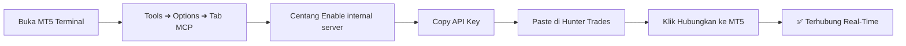

# 📖 Panduan Pengguna: Menghubungkan MetaTrader 5 via Native MCP

> **Hunter Trades Journal & AI Trading Engine**  
> Panduan resmi setup koneksi MetaTrader 5 (MT5) untuk masing-masing user menggunakan protokol **Native Model Context Protocol (MCP)**.

---

## 💡 Konsep & Solusi Arsitektur Multi-User

Setiap pengguna Hunter Trades memiliki terminal **MetaTrader 5** dan akun broker tersendiri. Pada versi terbaru:
1. **Tidak Membutuhkan Python Server / Aplikasi Tambahan**: MT5 modern kini telah dilengkapi **Native MCP Server** internal resmi dari MetaQuotes.
2. **API Key Masing-Masing User**: Setiap terminal MT5 menghasilkan **API Key unik** yang bertindak sebagai token otentikasi lokal yang aman.
3. **Privasi & Keamanan Maksimal**: Anda **tidak perlu menginput password broker** Anda ke Hunter Trades. Hunter Trades berkomunikasi langsung dengan MT5 lokal melalui API Key.

---

## 🚀 Langkah-Langkah Menghubungkan MT5 (Langkah Demi Langkah)

### Langkah 1: Buka MetaTrader 5
1. Buka aplikasi **MetaTrader 5** di PC / Laptop / VPS Windows Anda.
2. Pastikan Anda sudah login ke akun trading Anda (Demo ataupun Real).

### Langkah 2: Buka Pengaturan MCP
1. Pada menu bar bagian atas MT5, klik **Tools** ➜ **Options** (atau gunakan shortcut keyboard <kbd>Ctrl + O</kbd>).
2. Di jendela Options, klik tab **MCP** di bagian paling kanan.

### Langkah 3: Aktifkan Internal Server & Dapatkan API Key
1. Centang kotak **"Enable internal server"**.
2. Perhatikan kolom **API Key**:
   - Jika kolom sudah terisi string acak (misal: `1oBaWtEsZuqVsfzLoHlALKBt...`), klik tombol **Copy** di sampingnya.
   - Jika kolom masih kosong, klik tombol **Generate**, lalu klik **Copy**.
3. Pastikan kolom **Server address** berada pada default: `http://127.0.0.1:22346` (atau `22346`).
4. Klik tombol **OK** untuk menyimpan konfigurasi di MT5.

### Langkah 4: Hubungkan di Hunter Trades
1. Buka aplikasi Hunter Trades (versi Desktop atau Web Dashboard).
2. Masuk ke menu **AI Trading** (atau menu **Settings ➜ Integrations ➜ MetaTrader**).
3. Tempelkan (**Paste**) API Key yang sudah Anda salin ke form **MT5 MCP API Key**.
4. Klik tombol **Hubungkan ke MT5** (atau **Establish Connection**).

Dalam 1–2 detik, Hunter Trades akan langsung menampilkan:
- ✅ Status: **Connected**
- 💰 **Account Balance & Equity**
- 📊 **Open Positions & History**
- 🤖 **AI Trading Execution & Signal Engine siap aktif**

---

## ⚙️ Opsi Lanjutan (Advanced Configuration)

Jika Anda menjalankan MT5 di port custom atau remote port:
- Buka dropdown **"Opsi Lanjutan (Address & Port)"** pada form koneksi.
- Masukkan URL MCP Anda (contoh: `http://127.0.0.1:22346/mcp`).

---

## ❓ Troubleshooting & Tanya Jawab (FAQ)

### 1. Mengapa tab "MCP" tidak muncul di menu Options MT5 saya?
* **Penyebab**: Versi MetaTrader 5 Anda belum mendukung fitur Native MCP (butuh MT5 build terbaru).
* **Solusi**: 
  - Di MT5, klik menu **Help** ➜ **Check for Updates** ➜ **Latest Beta/Release Version**.
  - Atau unduh installer MT5 terbaru dari broker Anda / situs resmi MetaQuotes.

### 2. Error: "Connection failed" / "Failed to connect to MT5"
* **Penyebab**: 
  - Terminal MT5 belum dibuka / ditutup saat menekan tombol hubungkan.
  - Opsi *Enable internal server* belum dicentang di MT5.
  - Firewall Windows memblokir port internal 22346.
* **Solusi**:
  1. Pastikan MT5 tetap terbuka di latar belakang.
  2. Buka *Tools ➜ Options ➜ MCP*, pastikan *Enable internal server* sudah dicentang dan klik *OK*.
  3. Coba klik kembali *Hubungkan ke MT5*.

### 3. Apakah API Key saya aman?
* **Ya, 100% Aman**: API Key hanya bekerja untuk komunikasi lokal antara Hunter Trades dan MT5 di PC Anda (`127.0.0.1`). Password akun broker Anda tidak pernah dibagikan atau disimpan dalam bentuk plaintext.

---

## 📞 Bantuan Tambahan
Jika Anda mengalami kendala saat menghubungkan akun Anda, silakan hubungi tim support Hunter Trades melalui komunitas Discord resmi kami.
