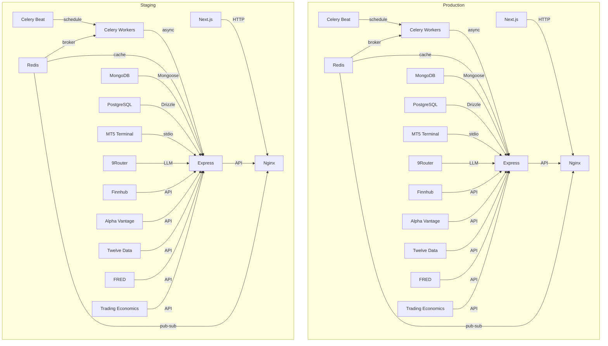

# Journal Trade — Infrastructure Architecture

## Overview

```mermaid
flowchart TD
    subgraph Client
        A[User Browser] -->|HTTP| B[Next.js SSR]
        C[Telegram Bot] -->|Webhook| B
        D[Discord Auth] -->|OAuth| B
    end

    subgraph Gateway
        B -->|:3000| E[Nginx Reverse Proxy]
        F[Express API] -->|:5000| E
    end

    subgraph Application
        G[Trading Pipeline] -->|async| H[MT5 MCP Server]
        I[AI Backtest Skill] -->|async| J[9Router Gateway]
        K[Walk-Forward Optimization] -->|async| J
        L[Trade Journal Analysis] -->|async| J
        M[Auto-Backtest Batch] -->|async| J
        N[Market Regime Detection] -->|async| O[Strategy Engine]
        P[News Calendar] -->|async| O
        Q[Fundamental Analysis] -->|async| O
        R[Risk Manager] -->|async| O
        S[Autonomous Mode] -->|async| O
    end

    subgraph ML_Inference
        J -->|parallel| T[Claude]
        J -->|parallel| U[Gemini]
        J -->|parallel| V[Groq]
        J -->|parallel| W[DashScope]
        J -->|parallel| X[OpenRouter]
    end

    subgraph Data
        Y[MongoDB] -->|Mongoose| G
        Z[PostgreSQL] -->|Drizzle| I
        AA[Redis] -->|cache| G
        AA -->|pub-sub| B
        AA -->|broker| AB[Celery Workers]
        AB -->|async| G
        AB -->|async| I
        AB -->|async| J
        AB -->|async| K
        AB -->|async| L
        AB -->|async| M
        AC[Celery Beat] -->|schedule| AB
    end

    subgraph External
        AD[MT5 Terminal] -->|stdio| H
        AE[Finnhub] -->|API| G
        AF[Alpha Vantage] -->|API| G
        AG[Twelve Data] -->|API| G
        AH[FRED] -->|API| G
        AI[Trading Economics] -->|API| G
    end
```

## Key Components

### 1. ML Inference Layer

- **9Router Gateway**: Routes LLM requests to multiple providers (Claude, Gemini, Groq, DashScope, OpenRouter)
- **Parallel Execution**: All providers called simultaneously with 8s timeout
- **Consensus Threshold**: ≥50% agreement required to execute trades
- **Dispatch Mechanism**: Celery workers handle non-blocking execution

### 2. Celery Queue System

- **Broker**: Redis (shared instance with cache)
- **Backend**: Redis (result storage)
- **Worker Types**:
  - Inference workers (handle LLM calls)
  - Backtest workers (execute backtests)
  - Sync workers (periodic data sync)
- **Beat Scheduler**:
  - Periodic auto-backtest
  - Skill update jobs

### 3. Redis Cache

- **Market Data**: Rates, symbol info (TTL 1-5s)
- **LLM Responses**: Avoid re-inference (TTL 5min)
- **Session Store**: Pipeline state, connection status
- **Pub/Sub**: Real-time pipeline events → frontend SSE
- **Celery Broker**: Task queue + result backend

### 4. Database Split

- **MongoDB (Mongoose)**: User data, trade logs, sessions, skills (15 collections)
- **PostgreSQL (Drizzle)**: Structured analytics, backtest results, migrations
- **Migration Path**: MongoDB → PostgreSQL for new structured data

### 5. MT5 Gateway Constraint

- **Single Connection**: Only ONE process can hold MT5 terminal connection
- **MCP Bridge**: Node.js → Python stdio bridge
- **Encryption**: AES-256-CBC for credentials
- **Auto-Reconnect**: 3 retry attempts

## Deployment Architecture

## Monitoring and Maintenance

- **Health Checks**: Endpoint monitoring for all services
- **Logging**: Centralized logging with structured data
- **Alerting**: Critical failure notifications
- **Scaling**: Horizontal scaling for Celery workers
- **Backup**: Regular database backups

## Security Considerations

- **Credential Encryption**: AES-256-CBC for MT5 credentials
- **API Rate Limiting**: All external API calls are rate-limited
- **Data Validation**: Strict input validation at all layers
- **Network Isolation**: Separate VPC for production environment

## Performance Optimization

- **Caching Strategy**: Aggressive caching for market data and LLM responses
- **Connection Pooling**: Database connection pooling
- **Asynchronous Processing**: Non-blocking operations for all external calls
- **Load Balancing**: Nginx load balancing for frontend and API

## Future Enhancements

- **Multi-Broker Support**: Extend beyond MT5 to other brokers
- **Advanced Analytics**: More sophisticated performance metrics
- **Machine Learning**: Continuous improvement of trading strategies
- **User Experience**: Enhanced frontend features based on usage data

## Conclusion

This infrastructure architecture provides a robust foundation for Journal Trade's AI trading system, balancing performance, reliability, and maintainability. The modular design allows for independent scaling of components as needed, while the Celery queue system ensures efficient handling of background tasks. The ML inference layer with consensus mechanism adds a layer of safety to trading decisions.